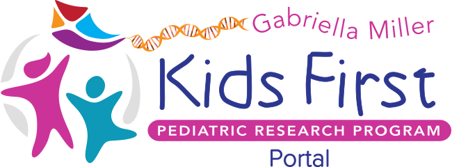
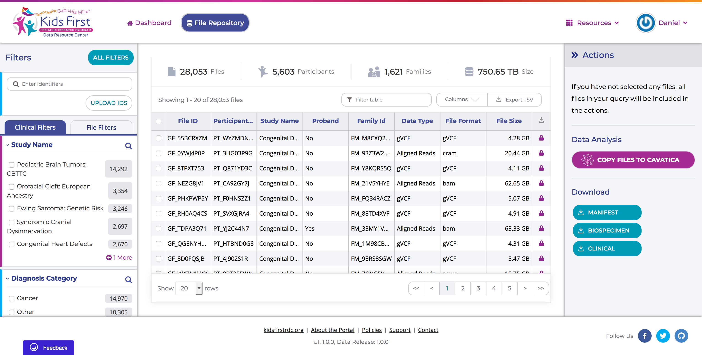

<p align="center">
  
</p>

<p align="center">
  <a href="https://github.com/kids-first/kf-portal-ui/blob/master/LICENSE"></a>
</p>

# Kids First Portal

The Kids First Portal powers the file browser and user profile interfaces
using [Arranger](https://github.com/overture-stack/arranger)
and [Persona](https://github.com/overture-stack/persona) services.



## Development

Install dependencies and start the development server:

```
npm i
npm start
```

Please make sure your code has been formatted using [Prettier](https://prettier.io/)

### Service Dependencies

For full functionality, the portal needs to interact with many APIs.
All API endpoints may be set inside the environment.
Copy `.env.schema` to `.env.local` and configure it with appropriate endpoints.

### Analyzing the build

```
npm run analyze
```

#### See

[webpack-bundle-analyzer npm page](https://www.npmjs.com/package/webpack-bundle-analyzer)

### Contributing

#### Branches

All new development should happen on a supporting branch on the developper fork rather than directly on `dev` or `master`.

Once development is complete for the scope defined by the supporting branch, a pull request can be made for the `dev` branch against upstream for code review.

1. Fork kf-portal-ui | go to [kids first portal repo](https://github.com/kids-first/kf-portal-ui) then follow [these instruction](https://help.github.com/en/github/getting-started-with-github/fork-a-repo#fork-an-example-repository)

2. Clone

   ```
   git clone git@github.com:kids-first/kf-portal-ui.git
   git remote add [unique_name] git@github.com:[your fork]
   ```

3. Create a new task branch

   ```sh
   git fetch --all
   git checkout -B [my_branch] origin/dev
   ```

4. Rebase against origin dev before creating a push request

   ```
   git fetch --all
   git rebase -i origin/dev
   ```

5. Create a push request

   ```
    git push [unique_name] [my_branch]
   ```

6. go to [kids first portal repo](https://github.com/kids-first/kf-portal-ui) and create the push request

#### Commit

Commit message should follow a customized [conventional commits specification](https://www.conventionalcommits.org/en/v1.0.0/)

Message structure is `type([scope]): #[github ticker number] message`

e.g.

```
"fix(CohortBuild): #23432 Resolve issue with ..."

"feat: #23423 Member can now do ..."
```

Supported types:

- **build**: Changes that affect the build system or external dependencies (example scopes: gulp, broccoli, npm)
- **ci**: Changes to our CI configuration files and scripts (example scopes: Travis, Circle, BrowserStack, SauceLabs)
- **docs**: Documentation only changes
- **feat**: A new feature
- **fix**: A bug fix
- **perf**: A code change that improves performance
- **refactor**: A code change that neither fixes a bug nor adds a feature
- **style**: Changes that do not affect the meaning of the code (white-space, formatting, missing semi-colons, etc)
- **test**: Adding missing tests or correcting existing tests

## Deployment

See [Documentation](./docs/deployment.md)

## Acknowledgement


