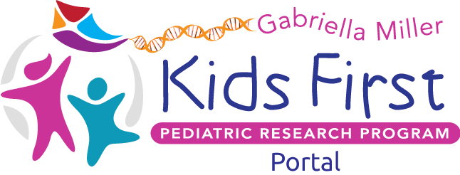

<p align="center">
  
</p>

# Kids First Portal

The Kids First Portal powers the file browser and user profile interfaces
using [Arranger](https://github.com/overture-stack/arranger)
and [Persona](https://github.com/overture-stack/persona) services.


## Development

Install dependencies and start the development server:

```
npm i
npm start
```

Please make sure your code has been formatted using [Prettier](https://prettier.io/)

### Service Dependencies

For full functionality, the portal needs to interact with many APIs.
All API endpoints may be set inside the environment.
Copy `.env.schema` to `.env.local` and configure it with appropriate endpoints.

### Contributing

* ### Branches

  All new development should happen on a supporting branch rather than directly on `next` or `master`. Supporting branches should be formatted as `<type>/##-couple-words` or `<type>/very-short-description`, where <type> denotes a change type that is one of the below:

  * feat (feature)
  * bug (bug fix)
  * docs (documentation)
  * refactor
  * test (when adding missing tests)
  * chore (maintain)

  Once development is complete for the scope defined by the supporting branch, a pull request can be made for the `next` branch for code review.
